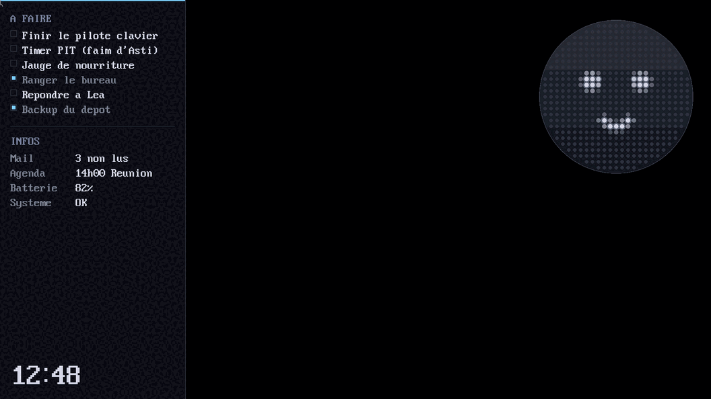

# Nothing OS

Un mini noyau "bare metal" x86_64, écrit en Rust, qui boot dans QEMU.

L'idée : un "OS" minimaliste en 1920×1080, fond noir, **tout se fait au
clavier**. Au centre, « NOTHING OS » en points et une **barre de
commande** :

| commande | effet |
|---|---|
| `/app` | ouvre le lanceur (panneau glissant) : VS Code, Affinity, Discord → **plein écran**, Asti au premier plan avec l'humeur de l'appli |
| `/app terminal` | un vrai terminal (`ls`, `cat`, `echo`, `mkdir`, `write`, `rm`, `date`...) — fenêtre classique |
| `/app editeur` | un vrai éditeur de texte |
| `/app calc` | une calculatrice |
| `/fichier <nom>` | ouvre (ou crée) le fichier dans l'éditeur — sur le Mac si le partage 9p est présent |
| `/doc` (ou `/doc all`) | consulte les documents dans un panneau glissant (voir plus bas) |
| `/web <mots>` | recherche **locale** dans les fichiers (pas de réseau) |

Les fichiers vivent dans un **système de fichiers** (`src/fs.rs`) rendu
**persistant** sur un disque : `make run` monte une image
`nothingos.img` (16 Mio, sur le Mac) que le noyau voit comme un vrai
disque dur (pilote ATA, `src/ata.rs`). Les fichiers survivent au
redémarrage de Nothing OS. Éditer un fichier dans l'éditeur puis faire
`cat` dans le terminal : c'est le même fichier.

**Partage de dossier avec le Mac (virtio-9p).** `make run` expose aussi
`~/Documents` du Mac au noyau via `-fsdev`/`virtio-9p-pci` (transport
virtio *legacy*, `src/virtio.rs` ; scan PCI `src/pci.rs` ; client
9P2000.L `src/p9.rs`). `src/hostfs.rs` fait le pont : `/fichier notes.md`
lit le vrai fichier du Mac dans l'éditeur, et toute modification est
**réécrite sur le Mac** (toutes les 2 s et à la fermeture). Un fichier
qui n'existe pas encore est créé côté Mac. `/document` liste le partage.
Changer le dossier partagé : `make run SHARE=~/mon-dossier`. Limites
actuelles : lecture plafonnée à `fs::FCAP` (12 Kio, les fichiers plus
gros sont ouverts en lecture seule), pas de sous-dossiers dans l'appli
Fichiers, collision si deux fichiers de dossiers différents ont le même
nom.

**Consultation de documents** (`/doc`) : ce ne sont pas des fenêtres
classiques. La **liste** entre par la gauche (molette pour défiler) ; un
clic sur un fichier fait entrer sa **visualisation** par la droite, avec
un espace au milieu. On ferme en cliquant dans cet espace / en dehors
(le panneau du dessus « se retire », droite puis gauche) ou avec Échap —
rien n'est empilé ni mémorisé. `src/docview.rs`. La molette PS/2
(IntelliMouse) est détectée au boot (`src/mouse.rs`).

Un clic sur un **dossier** du partage y descend ; le **fil d'Ariane**
`racine / … ` en haut du panneau, cliquable, permet de remonter.

- **Images** (`.png`, `.jpg`, `.jpeg`) : vraiment décodées et affichées
  (`src/image.rs`, crates `zune-png` / `zune-jpeg`), réduites par moyenne
  de bloc autant qu'il faut et quantifiées vers un cube de 180 couleurs.
  Le tas noyau est à 512 Mio pour ça, QEMU démarre avec `-m 1G`.
- **Audio** (`.mp3`, `.wav`) : petit panneau lecteur (pas toute la
  largeur) avec play / pause, barre de progression cliquable, vitesses
  x1 / x1.5 / x2. Décodage : `src/wav.rs` (RIFF/PCM) et `src/mp3.rs`
  (minimp3 via `rmp3`, compilé en C cross-target — voir `cshim/`).
  Sortie son : pilote **AC'97** `src/ac97.rs`.
- **Vidéo** (`.mp4`, `.mov`, …) : « lecture vidéo indisponible » — pas de
  décodeur H.264 en bare-metal.
- Garde-fous : fichier > 24 Mio (images : 160 Mio) → « fichier trop
  volumineux » ; fichier non affichable (PDF, archives, binaire…) →
  « affichage non pris en compte » plutôt qu'un vidage d'octets.

À gauche, une barre latérale cachée (tâches, résumé, heure) qui glisse au
frôlement du bord. En haut à droite, **Asti** — le compagnon, un portage
du moteur de « PC Pet ». Asti reste **au-dessus de toutes les fenêtres**
et adopte l'humeur + la teinte de l'appli au premier plan. Son étagère de
friandises se déplie au survol ; un bouton « i » y ouvre PC Pet Hub.

Navigation clavier : **Échap** revient à la barre de commande, un clic
donne le focus à une fenêtre.



Côté technique, c'est l'alternative "raisonnable" à un vrai OS complet :
pas de pilotes matériels réels, pas de multi-tâche, juste assez de
plomberie bas niveau (boot PVH/multiboot, mode 64-bit, GDT, IDT,
framebuffer 1920×1080, souris PS/2) pour avoir un vrai noyau qui démarre,
avec une base saine pour ajouter des trucs petit à petit.

*(Captures réelles : `make run` sur un Mac Apple Silicon, QEMU via boot PVH.)*

## Comment ça boot

1. Le chargeur amène le CPU jusqu'à `boot/boot.asm` en mode protégé
   32-bit. Deux voies possibles :
   - **`qemu -kernel`** (voie par défaut, macOS inclus) : QEMU lit une
     *note PVH* (`XEN_ELFNOTE_PHYS32_ENTRY`) dans l'ELF et saute à
     `pvh_start`. Pas de GRUB.
   - **GRUB** (via une image ISO, `make iso`) : `boot.asm` est
     ré-assemblé avec `-d MULTIBOOT` pour émettre l'en-tête *Multiboot 1*,
     et l'entrée est `start` (qui vérifie le magic `0x2BADB002`).
2. `boot/boot.asm` (32-bit) vérifie que le CPU supporte CPUID et le mode
   long (64-bit), met en place des tables de pages (identity-map du 1ᵉʳ
   et du 4ᵉ GiB — ce dernier pour le framebuffer PCI), puis active la
   pagination.
3. `boot/long_mode.asm` (64-bit) reprend la main juste après le saut en
   mode long : il active SSE (nécessaire pour le code Rust) puis appelle
   `rust_main`.
4. `src/lib.rs` (Rust, `#![no_std]`) prend le relais : GDT (`src/gdt.rs`),
   IDT (`src/interrupts.rs`), calibration du TSC (`src/time.rs`), passage
   en mode graphique 640×480 (`src/fb.rs`), init souris (`src/mouse.rs`),
   puis `home::run()` (`src/home.rs`) : boucle de rendu ~30 img/s
   (bureau + Asti + étagère de friandises). Les traces de boot partent
   sur le port série.

## Une bidouille assumée : pas de cible bare-metal "propre"

La méthode standard pour faire un noyau Rust (le tuto *Writing an OS in
Rust*, crate `bootloader`) demande une toolchain **nightly** + le
composant **rust-src**, pour compiler `core`/`alloc` soi-même pour une
cible bare-metal sur mesure (`-Z build-std`).

Dans l'environnement cloud où ce projet a été construit, l'accès réseau
vers `static.rust-lang.org` était bloqué : impossible d'installer
nightly ou rust-src via `rustup`. Pour rester en Rust quand même, ce
noyau est compilé pour la cible **hôte** `x86_64-unknown-linux-gnu`
(celle qui est déjà installée par défaut, avec `core`/`alloc`
précompilés), avec :

- `crate-type = ["staticlib"]` : Rust produit juste un `.a`, pas un
  exécutable Linux — c'est notre assembleur (`boot.asm` +
  `long_mode.asm`) qui fournit le vrai point d'entrée et fait l'édition
  de liens finale à la main avec `ld` et un linker script maison.
- `relocation-model=static` (dans `.cargo/config.toml`) pour éviter le
  code position-indépendant, inutile ici.
- des implémentations maison de `memcpy`/`memset`/`memcmp`/`memmove`/
  `bcmp` et un `rust_eh_personality` bidon, parce que sur la cible hôte
  ces symboles sont normalement fournis par la libc, qu'on n'a pas ici.
- `RUSTC_BOOTSTRAP=1` (dans `.cargo/config.toml`) : certains gestionnaires
  d'interruption ont besoin de la convention d'appel spéciale
  `extern "x86-interrupt"`, qui est une fonctionnalité **nightly**
  (`#![feature(abi_x86_interrupt)]`) même si le compilateur qu'on utilise
  est stable. Cette variable d'environnement débloque l'usage de
  `#![feature(...)]` sur un compilateur stable — c'est un contournement
  connu et largement utilisé (pas une bidouille exotique), mais ça reste
  un pari sur une fonctionnalité non stabilisée, qui pourrait un jour
  changer de comportement.

Ça marche très bien pour ce qu'on fait (pas d'exceptions C++, pas de
vraie divergence d'ABI), mais ce n'est pas la voie "canonique". Si un
jour l'accès à `static.rust-lang.org` est possible (par exemple en
lançant ce projet sur ta machine plutôt qu'en environnement cloud
restreint), la vraie suite logique est de repasser sur une cible
bare-metal avec `rustup toolchain install nightly`, `rustup component
add rust-src`, une target JSON custom (`x86_64-nothing_os.json`) et
`cargo build -Z build-std=core,alloc`. C'est plus propre et ça enlève
tout le bricolage `memcpy`/`eh_personality`.

## Construire et lancer

QEMU charge l'ELF64 directement via la *note PVH* (`qemu -kernel ...`),
sans GRUB ni `grub-mkrescue`. C'est la voie par défaut du `Makefile`, et
elle marche pareil sur **macOS** et **Linux**. Testé sur Mac Apple
Silicon.

### macOS (Apple Silicon ou Intel)

```bash
# 1. Outils (Homebrew)
brew install rustup nasm qemu lld     # lld fournit ld.lld (éditeur de liens)
rustup default stable                 # installe la toolchain Rust stable
rustup target add x86_64-unknown-linux-gnu   # core/std x86_64 précompilés

# 2. Construire + lancer
make run            # plein écran — CLIQUE dans la fenêtre pour que la
                    #   souris marche (PS/2 relative) ; ⌃⌥G la relâche.
                    #   Lance aussi bridge/opener.sh (ouvre la vraie appli
                    #   Mac quand tu fais /app dans l'OS)
make run-win        # idem mais dans une fenêtre classique
make run-headless   # sans affichage, traces de boot sur le port série
```

Raccourci dans l'OS : **Maj + Tab + Cmd** pour l'éteindre.

> Le `Makefile` retrouve `cargo`/`rustc` via `rustup` même si le paquet
> Homebrew `rustup` ne les met pas dans le `PATH`.

Sur un Mac ARM, QEMU émule un x86_64 complet (plus lent qu'en natif, mais
imperceptible pour un noyau aussi petit).

### Linux

```bash
# Debian/Ubuntu — pour `make run` :
sudo apt install nasm qemu-system-x86 lld
rustup target add x86_64-unknown-linux-gnu

# en plus, pour la voie GRUB/ISO (`make iso` / `make run-iso`) :
sudo apt install grub-pc-bin grub-common xorriso mtools
```

```bash
make run        # QEMU direct (PVH, sans GRUB)
make iso        # construit nothing-os.iso via GRUB (boot.asm -d MULTIBOOT)
make run-iso    # lance l'ISO GRUB dans QEMU
```

### Si `ld.lld` n'est pas dispo

L'édition de liens finale a juste besoin d'un linker qui produit de
l'ELF64 et comprend un linker script. Alternatives à `ld.lld` :

```bash
make run LD=ld                    # le `ld` GNU (Linux)
brew install x86_64-elf-binutils  # puis :
make run LD=x86_64-elf-ld         # cross-binutils (macOS)
```

## Débogage

- `qemu.log` / l'option `-d int,guest_errors` de QEMU aide à repérer un
  triple fault (le CPU redémarre en boucle silencieusement sinon).
- Le port série (COM1, `0x3f8`) est utilisé pour des traces de debug
  (voir `src/serial.rs`) : `make run-headless` les affiche directement
  dans le terminal.
- Le code assembleur pose des points de contrôle bien identifiables sur
  le port série (`A` `C` `D` `E` `F` `G` en 32-bit, `H` `I` en 64-bit) à
  chaque étape du boot : très utile pour savoir où ça plante si l'écran
  reste noir. Un boot sain affiche `ACDEFGHI` puis les lignes
  `[nothing-os] ...`.

## État actuel

- ✅ Boot (PVH `qemu -kernel` **ou** GRUB/Multiboot) -> long mode -> Rust.
  Testé sur Mac Apple Silicon (`make run`).
- ✅ GDT + TSS (`src/gdt.rs`) : GDT 64-bit minimale + TSS avec une entrée
  dans l'IST, pour donner au gestionnaire de double fault sa propre pile.
  Sans ça, un débordement de la pile noyau ne pourrait pas être servi et
  finirait en triple fault (reboot silencieux).
- ✅ IDT (table des interruptions) : `src/interrupts.rs` gère `breakpoint`
  (int3, déclenché volontairement au démarrage pour prouver que ça
  marche) et `double_fault` (affiche un écran d'erreur, sur la pile IST
  dédiée, au lieu de faire planter QEMU en boucle silencieusement).
  Écran (`WRITER`) et port série (`SERIAL1`) sont maintenant des
  instances globales uniques, protégées par un mutex (`spin::Mutex`) —
  nécessaire dès qu'un gestionnaire d'interruption peut vouloir écrire à
  l'écran en même temps que le code "normal".
- ✅ Mode graphique (`src/fb.rs`) : **1920×1080**, 256 couleurs (palette
  DAC), via l'interface Bochs VBE de QEMU. L'adresse du framebuffer
  linéaire est lue dans le BAR0 PCI de la carte VGA ; `boot.asm`
  identity-mappe aussi le 4ᵉ GiB (0xC0000000..) pour l'atteindre.
  Back-buffer.
- ✅ Base de temps (`src/time.rs`) : calibration du TSC contre le canal 2
  du PIT (sans interruptions), avec garde-fous (repli 1 GHz) pour ne
  jamais renvoyer 0 et figer la boucle de rendu.
- ✅ **Asti** (`src/asti.rs`) : portage du moteur de PC Pet
  (`renderer/engine.js` + `pet.js`). Buffer de luminance `f32` 25×25,
  primitives identiques, `render(cv, ox)` (boîtier + relief, points
  éteints, 9 niveaux + halo). Jeu d'animations large : ~11 styles d'yeux,
  8 bouches, extras (cœurs, étoiles, notes, Z, miettes...), rotation,
  blush. `Brain` : repos (blink, regards, twitch, bâillement), **mode
  selon l'heure** (jour / soir / nuit, via CMOS), une **pose de
  dégustation par friandise** (nom, nibble, gnaw, gulp, crunch, spicy,
  sugarrush, recharge), et des **humeurs spontanées** toutes les ~30 s
  (content, amour, danse, tête qui tourne...). Poses spécifiques aux
  applis non portées (pas de détection d'app dans l'OS).
- ✅ Souris PS/2 (`src/mouse.rs`) : polling. Curseur agrandi + anneau au
  clic. Vide aussi les octets clavier vers `src/kbd.rs`.
- ✅ Clavier PS/2 (`src/kbd.rs`) : suit les touches enfoncées.
  **Maj + Tab + Cmd → extinction** (`power_off()`, ACPI QEMU).
- ✅ Horloge CMOS (`src/rtc.rs`) : heure réelle (BCD, 12/24 h).
- ✅ Police (`src/font.rs`) : récupérée du plan 2 de la VRAM (celle du
  BIOS) ; rendu normal, mis à l'échelle, ou en points (`draw_str_dots`).
- ✅ Bureau (`src/home.rs`) : fond noir. Au centre « NOTHING OS » en
  points + barre de recherche (visuelle). **Barre latérale cachée**
  (tâches, séparateur centré discret, résumé, horloge) qui glisse depuis
  la gauche au frôlement du bord. Asti en haut à droite, toujours visible.
- ✅ Friandises (`src/shelf.rs`) : 9 motifs LED de `treats.html`. Étagère
  cachée, se déplie au survol d'Asti. **Glisser-déposer** une friandise
  sur Asti → dégustation ; sinon elle revient. Bouton « i » → PC Pet Hub.
- ✅ Clavier PS/2 (`src/kbd.rs`) : scancodes → ASCII, la barre de commande
  est éditable, Entrée exécute. Maj+Tab+Cmd éteint la machine.
- ✅ Fenêtres (`src/win.rs`) : mini gestionnaire (6 max, z-order, focus,
  glisser par la barre de titre, bouton fermer). Le clavier va à la
  fenêtre au premier plan (éditeur / terminal / calc) ou à la barre.
- ✅ Système de fichiers (`src/fs.rs`) : fichiers + dossiers, emplacements
  fixes sans allocateur, **persistant sur disque**.
- ✅ Pilote disque ATA/IDE PIO (`src/ata.rs`) : lecture/écriture de
  secteurs. Le fs est écrit sur `nothingos.img` (`sync` ou toutes les 2 s).
- ✅ Terminal (`src/term.rs`) : mini shell réel qui agit sur le fs.
- ✅ Éditeur de texte (`src/editor.rs`) : édition réelle (curseur,
  flèches, multi-lignes), écrit dans le fichier fs directement.
- ✅ Allocateur de tas (`src/heap.rs`) : 512 Mio en `.bss`,
  `linked_list_allocator` → `Vec` / `String` / `Box` disponibles.
- ✅ Partage 9p (`src/pci.rs`, `src/virtio.rs`, `src/p9.rs`,
  `src/hostfs.rs`) : `~/Documents` du Mac lu/écrit depuis Nothing OS via
  `/fichier` et `/doc`.
- ✅ Consultation `/doc` (`src/docview.rs`) : panneaux glissants, sous-
  dossiers + fil d'Ariane, aperçu images (`src/image.rs`) et lecteur
  audio.
- ✅ Son (`src/ac97.rs`) : pilote AC'97 (PCM stéréo 16 bits). Décodeurs
  `src/wav.rs` et `src/mp3.rs` (minimp3). Asti prend la personnalité
  « musique » pendant la lecture.
- ✅ Applis plein écran (`src/apps.rs`) : `/app` → lanceur → VS Code /
  Affinity / Discord, Asti au-dessus avec l'humeur de l'appli.
- ✅ Bureau distant (`src/remote.rs` + `bridge/`) : le **vrai** Discord du
  Mac affiché et pilotable dans l'OS, via un pont qui passe les images et
  les entrées par le partage 9p. Voir `bridge/README.md`.

## Prochaines étapes possibles

- **Pont web** : un petit assistant côté Mac qui rend une page et la
  renvoie au noyau par 9p (pour `/web`).
- **Lancement en kiosque** : démarrer Nothing OS directement à
  l'allumage.
- **Timer (PIT, IRQ0)** : faim d'Asti qui descend + jauge visible.
- **Streaming audio** : décoder le MP3 au fil de la lecture (aujourd'hui
  tout est décodé d'un coup → gel de l'UI sur un long fichier).
- Souris / clavier / timer / son en **interruptions** au lieu du polling.
- Sauvegarde explicite dans l'éditeur (Ctrl+S), copier/coller, molette.
- Redimensionner les fenêtres, une vraie barre des tâches.
- Porter plus de poses/teintes de PC Pet (bâillement, sommeil la "nuit",
  réactions).
- Un ordonnanceur minimal (coopératif d'abord) pour faire tourner
  plusieurs "tâches".
- Basculer sur une vraie cible bare-metal + nightly (voir plus haut) une
  fois qu'un accès réseau complet est possible, pour se débarrasser du
  bricolage `memcpy`/`eh_personality`.
