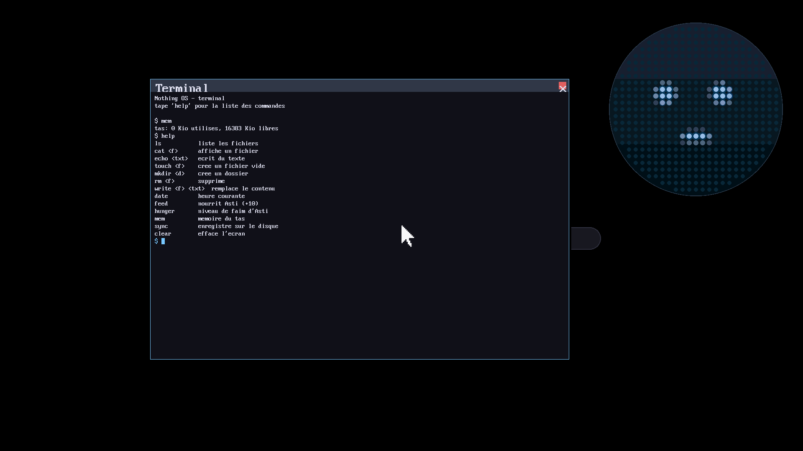

# Nothing OS

Un mini noyau "bare metal" x86_64, écrit en Rust, qui boot dans QEMU.

L'idée : un "OS" sans bureau, sans applications, sans menu. L'écran
d'accueil est un fond noir avec le nom de l'OS, le personnage **Asti**,
et sa **barre de nourriture**. C'est tout — pour le moment.

Côté technique, c'est l'alternative "raisonnable" à un vrai OS complet :
pas de pilotes matériels réels, pas de multi-tâche, juste assez de
plomberie bas niveau (bootloader multiboot, passage en mode 64-bit, GDT,
IDT, écran texte VGA) pour avoir un vrai noyau qui démarre, avec une base
saine pour ajouter des trucs petit à petit.



> ⚠️ La capture ci-dessus montre encore l'ancien écran de boot ; l'écran
> d'accueil "Asti" n'a pas encore été re-photographié (pas de QEMU sur la
> machine de dev actuelle).

## Comment ça boot

1. **GRUB** (via une image ISO) charge `kernel.bin` en mémoire et démarre
   le CPU en mode protégé 32-bit, comme le veut la norme *Multiboot 1*.
2. `boot/boot.asm` (32-bit) vérifie qu'on a bien été chargé par un
   bootloader multiboot, que le CPU supporte CPUID et le mode long
   (64-bit), met en place des tables de pages pour identity-mapper le
   premier Gio de RAM, puis active la pagination.
3. `boot/long_mode.asm` (64-bit) reprend la main juste après le saut en
   mode long : il active SSE (nécessaire pour le code Rust) puis appelle
   `rust_main`.
4. `src/lib.rs` (Rust, `#![no_std]`) prend le relais : il installe la GDT
   (`src/gdt.rs`) et l'IDT (`src/interrupts.rs`), puis appelle
   `home::render()` (`src/home.rs`) qui dessine l'écran d'accueil dans le
   buffer texte VGA (`0xb8000`), et boucle en `hlt`. Les traces de boot
   partent sur le port série pour ne pas encombrer l'écran.

## Une bidouille assumée : pas de cible bare-metal "propre"

La méthode standard pour faire un noyau Rust (le tuto *Writing an OS in
Rust*, crate `bootloader`) demande une toolchain **nightly** + le
composant **rust-src**, pour compiler `core`/`alloc` soi-même pour une
cible bare-metal sur mesure (`-Z build-std`).

Dans l'environnement cloud où ce projet a été construit, l'accès réseau
vers `static.rust-lang.org` était bloqué : impossible d'installer
nightly ou rust-src via `rustup`. Pour rester en Rust quand même, ce
noyau est compilé pour la cible **hôte** `x86_64-unknown-linux-gnu`
(celle qui est déjà installée par défaut, avec `core`/`alloc`
précompilés), avec :

- `crate-type = ["staticlib"]` : Rust produit juste un `.a`, pas un
  exécutable Linux — c'est notre assembleur (`boot.asm` +
  `long_mode.asm`) qui fournit le vrai point d'entrée et fait l'édition
  de liens finale à la main avec `ld` et un linker script maison.
- `relocation-model=static` (dans `.cargo/config.toml`) pour éviter le
  code position-indépendant, inutile ici.
- des implémentations maison de `memcpy`/`memset`/`memcmp`/`memmove`/
  `bcmp` et un `rust_eh_personality` bidon, parce que sur la cible hôte
  ces symboles sont normalement fournis par la libc, qu'on n'a pas ici.
- `RUSTC_BOOTSTRAP=1` (dans `.cargo/config.toml`) : certains gestionnaires
  d'interruption ont besoin de la convention d'appel spéciale
  `extern "x86-interrupt"`, qui est une fonctionnalité **nightly**
  (`#![feature(abi_x86_interrupt)]`) même si le compilateur qu'on utilise
  est stable. Cette variable d'environnement débloque l'usage de
  `#![feature(...)]` sur un compilateur stable — c'est un contournement
  connu et largement utilisé (pas une bidouille exotique), mais ça reste
  un pari sur une fonctionnalité non stabilisée, qui pourrait un jour
  changer de comportement.

Ça marche très bien pour ce qu'on fait (pas d'exceptions C++, pas de
vraie divergence d'ABI), mais ce n'est pas la voie "canonique". Si un
jour l'accès à `static.rust-lang.org` est possible (par exemple en
lançant ce projet sur ta machine plutôt qu'en environnement cloud
restreint), la vraie suite logique est de repasser sur une cible
bare-metal avec `rustup toolchain install nightly`, `rustup component
add rust-src`, une target JSON custom (`x86_64-nothing_os.json`) et
`cargo build -Z build-std=core,alloc`. C'est plus propre et ça enlève
tout le bricolage `memcpy`/`eh_personality`.

## Construire et lancer

Prérequis (Linux ; voir la note macOS plus bas) :

```bash
# Debian/Ubuntu
sudo apt install nasm qemu-system-x86 grub-pc-bin grub-common xorriso mtools
# + une toolchain Rust stable (rustup.rs, ou via ton gestionnaire de paquets)
```

```bash
make            # build kernel.bin + nothing-os.iso
make run        # build puis lance dans QEMU avec un écran
make run-headless   # pareil mais sans fenêtre, sortie sur le port série
```

### Note pour macOS

`grub-mkrescue` est pénible à avoir sur macOS (il faut une version
croisée de GRUB, ex. via un tap Homebrew type `x86_64-elf-grub`, pas
toujours maintenu). Le plus simple pour itérer sur ce projet depuis ton
Mac :

- soit installer `nasm` et `qemu` via Homebrew et me redemander de
  reconstruire/tester dans cet environnement cloud (qui a déjà tout
  l'outillage GRUB) ;
- soit lancer ce dépôt dans un conteneur Linux (Docker Desktop, ou une
  image `ubuntu` avec les paquets ci-dessus) sur ta machine.

## Débogage

- `qemu.log` / l'option `-d int,guest_errors` de QEMU aide à repérer un
  triple fault (le CPU redémarre en boucle silencieusement sinon).
- Le port série (COM1, `0x3f8`) est utilisé pour des traces de debug
  (voir `src/serial.rs`) : `make run-headless` les affiche directement
  dans le terminal.
- Le code assembleur pose des points de contrôle bien identifiables sur
  le port série (des lettres `A`, `B`, `C`...) à chaque étape du boot :
  très utile pour savoir où ça plante si jamais l'écran reste noir.

## État actuel

- ✅ Boot multiboot -> long mode -> Rust, écran texte VGA (voir plus haut)
- ✅ GDT + TSS (`src/gdt.rs`) : GDT 64-bit minimale + TSS avec une entrée
  dans l'IST, pour donner au gestionnaire de double fault sa propre pile.
  Sans ça, un débordement de la pile noyau ne pourrait pas être servi et
  finirait en triple fault (reboot silencieux).
- ✅ IDT (table des interruptions) : `src/interrupts.rs` gère `breakpoint`
  (int3, déclenché volontairement au démarrage pour prouver que ça
  marche) et `double_fault` (affiche un écran d'erreur, sur la pile IST
  dédiée, au lieu de faire planter QEMU en boucle silencieusement).
  Écran (`WRITER`) et port série (`SERIAL1`) sont maintenant des
  instances globales uniques, protégées par un mutex (`spin::Mutex`) —
  nécessaire dès qu'un gestionnaire d'interruption peut vouloir écrire à
  l'écran en même temps que le code "normal".
- ✅ Écran d'accueil (`src/home.rs`) : fond noir, nom de l'OS, personnage
  **Asti** en art ASCII, et **barre de nourriture** (`Nourriture [██░░] 62%`,
  couleur verte/jaune/rouge selon le niveau). Dessiné une fois au boot.
  Le niveau de nourriture est un `AtomicU8` (`FOOD`) avec l'API
  `food()` / `set_food()` / `feed()` / `starve()` prête pour la suite.

## Prochaines étapes possibles

- **Timer (PIT, IRQ0)** : faire baisser la nourriture d'Asti avec le
  temps et re-`render()` l'accueil à chaque tick — c'est ce qui rendra
  Asti "vivant".
- **Pilote clavier PS/2 (IRQ1)** : une touche pour nourrir Asti
  (`home::feed(...)`), première vraie interaction.
- Un allocateur mémoire (`#[global_allocator]`) pour débloquer `alloc`
  (`Vec`, `String`, etc.).
- Un ordonnanceur minimal (coopératif d'abord) pour faire tourner
  plusieurs "tâches".
- Basculer sur une vraie cible bare-metal + nightly (voir plus haut) une
  fois qu'un accès réseau complet est possible, pour se débarrasser du
  bricolage `memcpy`/`eh_personality`.
